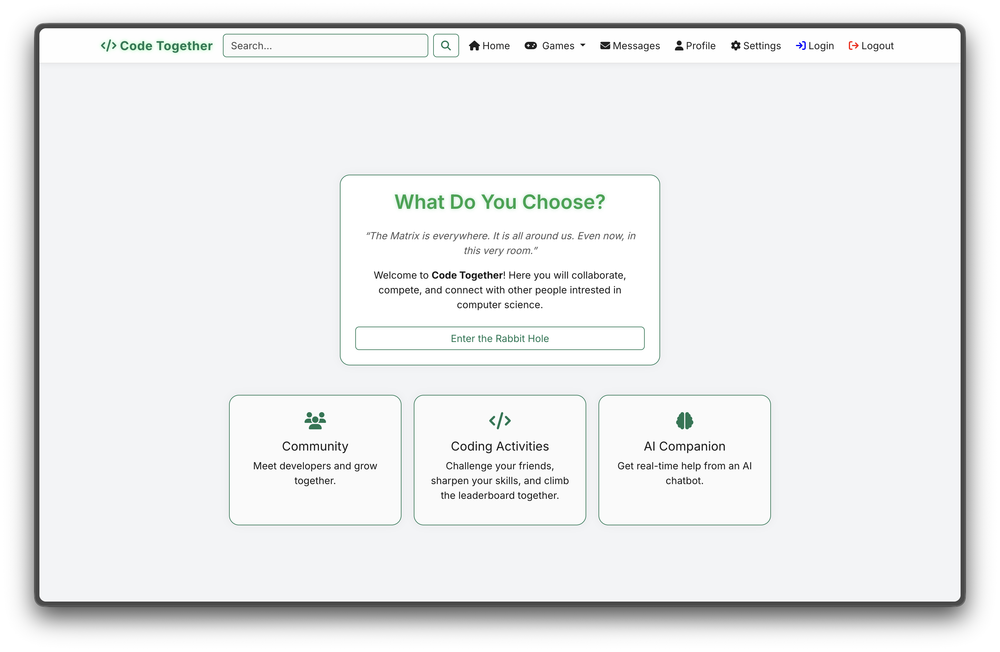
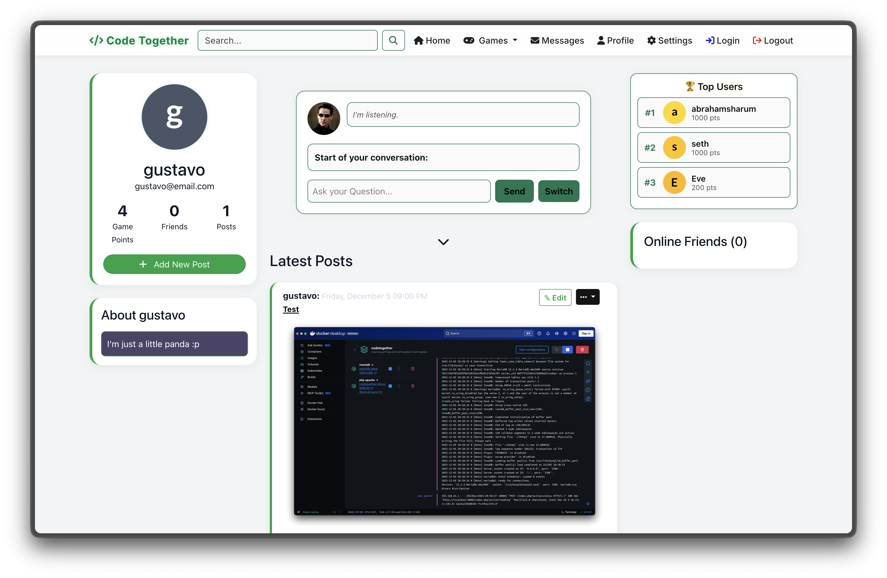
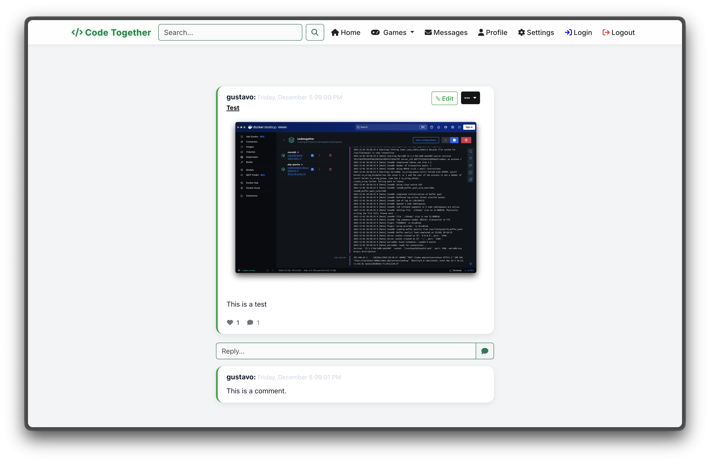
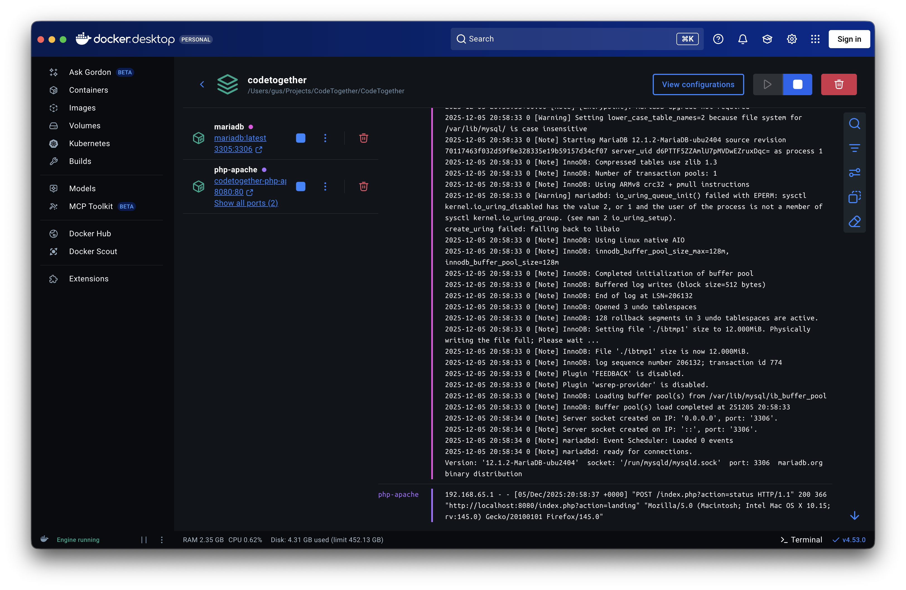

# CodeTogether - Codebase Review

## System Running on First Install





## Setup Report
Getting their system up and running was pretty straight forward. They listed the prerequisites required very clearly. They also listed the commands needed in order to get the system up and running. For linux users, they had one command that brought everything up nice and easily.

## Strengths

1. **Clean MVC Architecture**: Proper separation of concerns with controllers, models, and views
2. **Security Foundations**: Password hashing (`dao/UserDAO.php:13`), prepared statements, XSS protection
3. **Modern PHP Practices**: Strict typing, proper error handling in database connections
4. **Role-Based Access Control**: Comprehensive permission system in `config/Router.php:51-77`
5. **Responsive Frontend**: Bootstrap 5 with custom theming and dark mode support

## Key Improvements

### High Priority: Add CSRF Protection
**Why it matters**: Prevents attackers from making unauthorized requests on behalf of users.

CSRF (Cross-Site Request Forgery) Protection is a security mechanism that prevents attackers from tricking users into performing unwanted actions on websites where they're authenticated.

Imagine you're logged into your bank's website. An attacker sends you a link to a malicious site that contains hidden code like:

```html

```

#### How CSRF Protection Works
CSRF protection typically uses tokens that are random and have unpredictable values that are:
1. Generated by the server when you load on a form page.
2. Embedded in forms as hidden fields or in request headers.
3. Verified on submission - the server checks that the token matches what it originally sent.

Since the attacker's malicious site can't access your legitimate tokens (due to the browser's same-origin policy), they can't forge valid requests.

**Current problem**: Login form has no protection:
```php
<form method="POST" action="">
    <input type="text" name="identifier" required>
    <input type="password" name="password" required>
</form>
```

**Easy fix**: Add a hidden token to forms:
```php
// At the top of your login page
// bin2hex(random_bytes(32)) - Generates a cryptographically secure random token (64 hex characters).
$_SESSION['csrf_token'] = bin2hex(random_bytes(32));

// In your form
<input type="hidden" name="csrf_token" value="<?= $_SESSION['csrf_token'] ?>">

// In LoginController.php, before processing login
// hash_equals() - Prevents timing attacks by comparing strings in constant time
if (!hash_equals($_SESSION['csrf_token'], $_POST['csrf_token'] ?? '')) {
    $this->renderView("login", ['error' => 'Security token invalid']);
    exit;
}
```

This could be applied to all state changing forms, not just login:
- Registration
- Password Changes
- Profile Updates
- Any `POST`, `PUT`, `DELETE`operations

### Medium Priority: Clean Up Repeated Code
**Why it matters**: Makes your code easier to maintain and less error-prone.

**Current problem**: Same authentication check repeated in many controllers:
```php
// This appears in multiple controllers
if (!isset($_SESSION['usercreds']) || empty($_SESSION['usercreds']['userID'])) {
    header('Location: index.php?action=login');
    exit;
}
```

**Easy fix**: Create a base controller:
```php
// Create SecureController.php
abstract class SecureController extends Controller {
    protected function requireAuth(): void {
        if (!isset($_SESSION['usercreds']) || empty($_SESSION['usercreds']['userID'])) {
            header('Location: index.php?action=login');
            exit;
        }
    }
}

// Then in your protected controllers
class HomeController extends SecureController {
    public function performAction(): void {
        $this->requireAuth(); // One line instead of 5!
        // rest of your code...
    }
}
```

### Low Priority: Better Input Validation
**Why it matters**: Prevents weird inputs from breaking your application.

**Current problem**: Basic validation without length checks:
```php
$identifier = $_POST['identifier'] ?? '';
$password = $_POST['password'] ?? '';
```

**Easy fix**: Add simple validation:
```php
$identifier = trim($_POST['identifier'] ?? '');
$password = $_POST['password'] ?? '';

// Basic validation
if (strlen($identifier) < 3) {
    $this->renderView("login", ['error' => 'Username must be at least 3 characters']);
    exit;
}

if (strlen($password) < 8) {
    $this->renderView("login", ['error' => 'Password must be at least 8 characters']);
    exit;
}
```

## Conclusion
